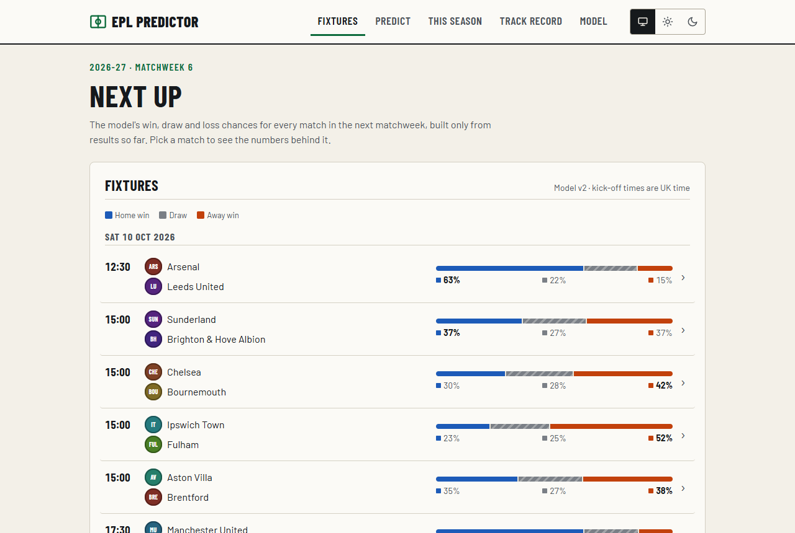
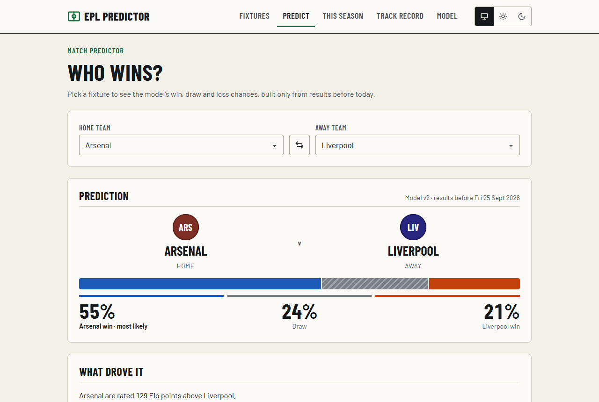
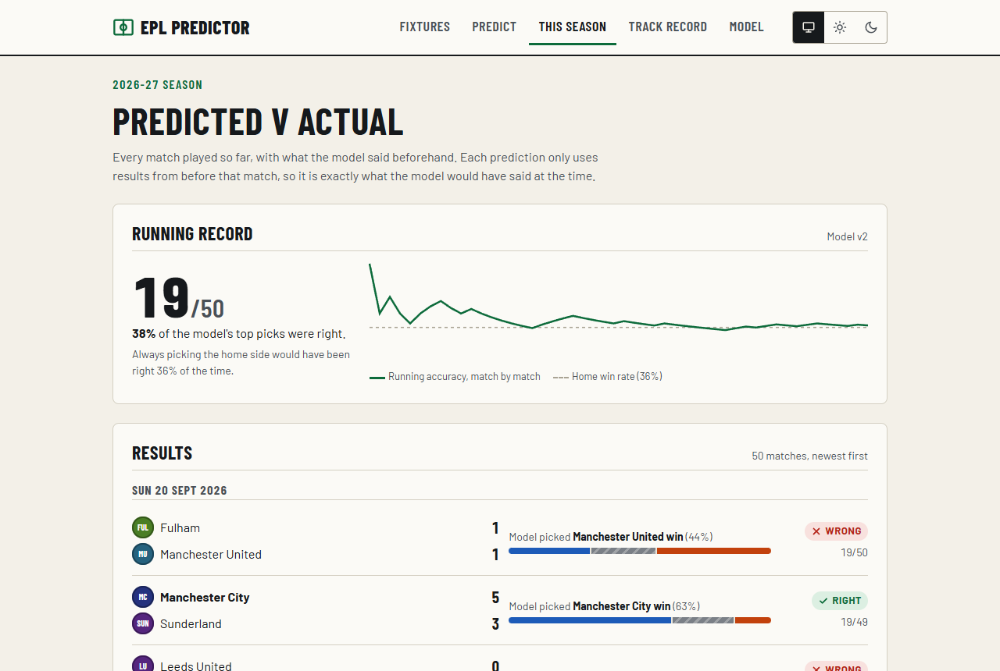
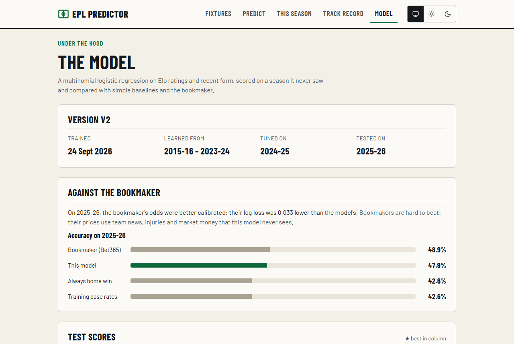
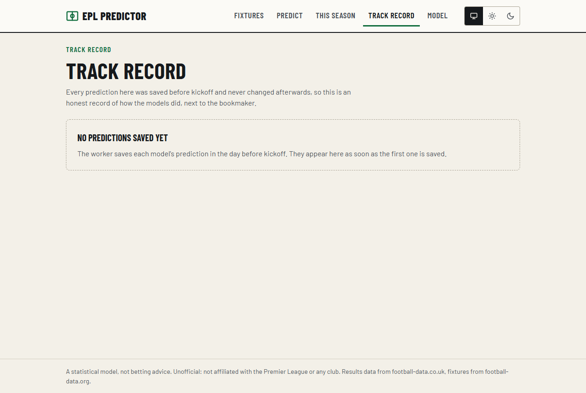
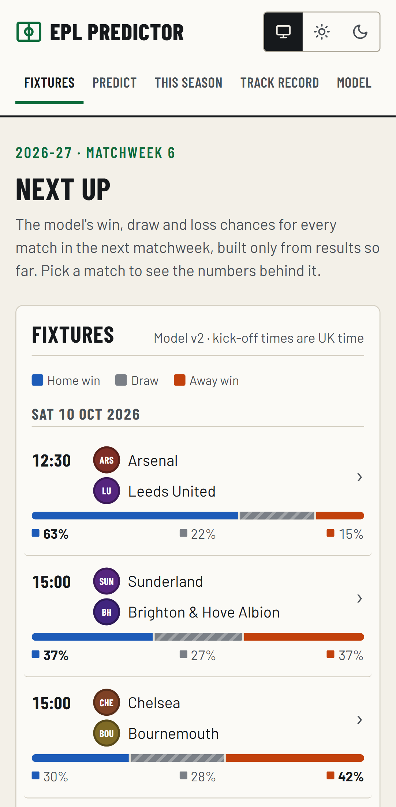
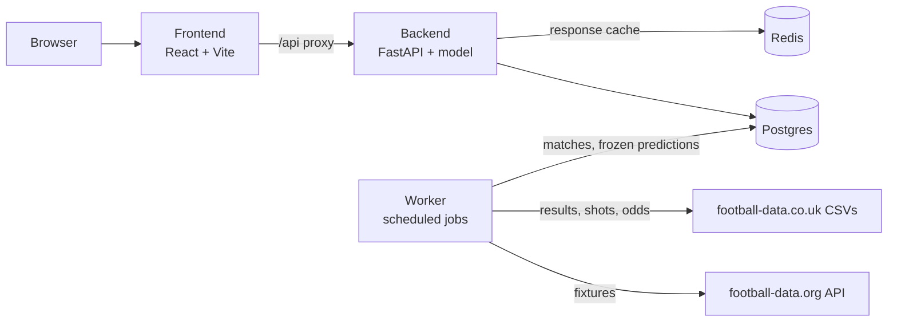

# EPL Predictor

Premier League match predictions from an Elo and form model, scored honestly against the bookmaker.

[](https://github.com/Yuvi-Pain/epl-predictor/actions/workflows/ci.yml)

**Live demo:** _TODO: add the link once it's deployed._



<table>
  <tr>
    <td></td>
    <td></td>
  </tr>
  <tr>
    <td align="center">Predict</td>
    <td align="center">This season</td>
  </tr>
  <tr>
    <td></td>
    <td></td>
  </tr>
  <tr>
    <td align="center">Model</td>
    <td align="center">Track record (empty until the first saved predictions are played)</td>
  </tr>
</table>



## What it does

I built a full-stack app that predicts home win, draw and away win probabilities for every Premier League match. A worker pulls fixtures and results from two public data sources into Postgres. A logistic regression turns each team's Elo rating and recent form into probabilities, and a React frontend shows the next matchweek, a head-to-head predictor, the model's record this season and its scores against the bookmaker. Before each kickoff the worker saves every model's prediction and never changes it, so the track record can't be quietly rewritten after the fact.

## Architecture



Everything runs in Docker Compose. The backend and worker share one image; the worker refreshes fixtures every 6 hours, results daily, and saves predictions hourly for matches in the next 24 hours.

## Results

Trained on 2015-16 to 2023-24, tuned on 2024-25, and scored once on the 2025-26 season (380 matches), which neither model saw during training or tuning. Lower is better for log loss and Brier score.

| 2025-26 test season | Accuracy | Log loss | Brier |
|---|---|---|---|
| v1: separate home and away Elo and form | 0.474 | 1.041 | 0.628 |
| v2: home-minus-away differences, tuned Elo | 0.479 | 1.052 | 0.633 |
| Bookmaker (Bet365, margin removed) | **0.489** | **1.019** | **0.612** |
| Training-set outcome rates | 0.426 | 1.084 | 0.656 |

Both models clearly beat the naive baseline, and neither beats the bookmaker. The more interesting result is v2. I searched 1,500 combinations of Elo settings, feature subsets and regularisation on the 2024-25 validation season, and the winner edged out the bookmaker there (log loss 0.969 against 0.971). On the untouched test season it lost to the bookmaker and to the simpler v1. That's validation overfitting: with one season of 380 matches, a big search finds settings that fit that season's noise. The Model page shows these test numbers, not the flattering validation ones. v2 is still the live model because it has a property v1 doesn't (a single, constant home advantage, checked by tests), and v1 runs in shadow mode so the two keep being compared on new matches.

## Engineering decisions

**Leak-free features, with a test that proves it.** Every feature for a match is built only from matches on earlier dates, not even other games on the same day. The leakage test rewrites or blanks every result from each date onward, rebuilds all features, and asserts that nothing up to that date changed. It also asserts that later features did change, so the test can't pass by altering nothing. To check the test itself, I switched the form merge to include same-day matches (a one-word change) and confirmed it fails.

**No training/serving skew.** Live predictions don't have their own feature code. The API adds the hypothetical match to the history and runs the same `build_features` function used in training, and the Elo settings and form window are read from the saved model file, not from code defaults. The frontend's API types are generated from the backend's OpenAPI schema, so a response change that breaks the UI fails the type check.

**Versioned cache keys and a circuit breaker.** Responses are cached in Redis with keys that include the model version and a data version counter. Every job that writes matches bumps that counter in the same transaction, so there is no invalidation code at all: new data means new keys, and stale entries just expire. If Redis goes down, the API keeps serving uncached responses and doesn't try Redis again for 30 seconds, so an outage doesn't add a connection timeout to every request.

**Frozen predictions and shadow mode.** The worker saves each model's prediction in the day before kickoff. Postgres stamps the time and only accepts the row if the match hasn't started, and a trigger rejects every update and delete on the table. The track record scores the live model, the shadow model and the bookmaker on exactly the same matches, so a new model can be proven on real fixtures before users see it.

## Tech stack

- **Backend:** Python 3.12, FastAPI, SQLAlchemy (async), Alembic, pandas, scikit-learn
- **Data:** Postgres 16, Redis 7
- **Frontend:** React 19, TypeScript, Vite, TanStack Query, React Router
- **Testing:** pytest (210 tests), Vitest and React Testing Library (48 tests), GitHub Actions
- **Infrastructure:** Docker Compose

## Running it locally

You need Docker with Compose.

```bash
cp .env.example .env
docker compose up --build
```

Open http://localhost:5173. On first start the worker downloads every season of results since 2015-16 (`docker compose logs -f worker` shows progress). For live fixtures, put a free [football-data.org](https://www.football-data.org/client/register) key in `.env` as `FOOTBALL_DATA_API_KEY`. Once the history has loaded, train both models:

```bash
docker compose exec backend python -m scripts.train_model --features v1
docker compose exec backend python -m scripts.train_model
docker compose restart backend worker
```

Tests, migrations, the data loader, the worker, training options, the API and the cache are covered in [docs/DEVELOPMENT.md](docs/DEVELOPMENT.md).

## Limitations and what I'd do next

- **It doesn't beat the bookmaker, and I don't expect it to.** The model knows results, shots and Elo; the odds also reflect team news, injuries, lineups and money. Adding expected goals and lineup data would be the first step to closing the gap.
- **Tuning on one season is fragile,** as the v2 result shows. Next I'd use rolling-origin validation across several seasons and a much smaller search.
- **The track record is only just starting.** It fills in from matchweek 6 of 2026-27, and a few hundred matches are needed before the model comparison means much.
- **It never picks a draw.** Across the 2025-26 test season a draw was never the most likely outcome, even though 104 of its 380 matches ended level. That is typical for this kind of model and the draw probabilities are still used in the scores, but it caps accuracy.
- **Not deployed yet.** It runs locally in Compose. Deploying it needs a managed Postgres and Redis and a production frontend build in place of the Vite dev server.

## Data and disclaimer

Results, shots on target and Bet365 odds come from [football-data.co.uk](https://www.football-data.co.uk/). Fixtures and kick-off times come from the [football-data.org](https://www.football-data.org/) API. Thanks to both for making the data available.

This is a statistical model built as a learning project. It is not betting advice. It is not affiliated with the Premier League or any club.
